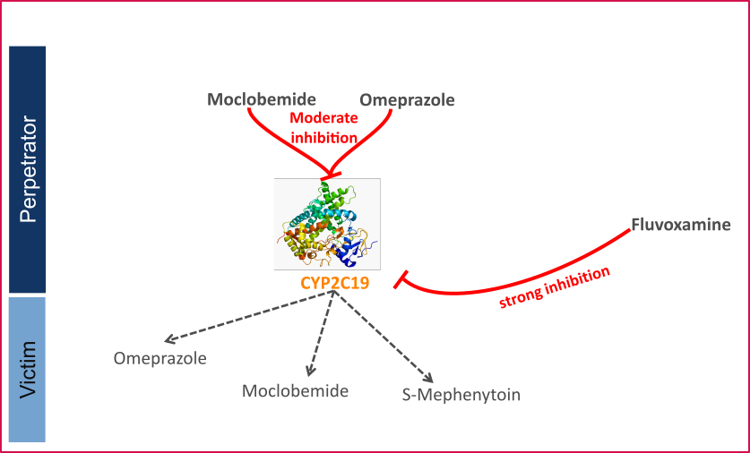

CYP2C19 is an important enzyme for the metabolism of about 10% of therapeutical drugs, including proton pump inhibitors (PPIs, e.g., omeprazole), antidepressants (e.g., imipramine), anticonvulsants (phenytoin, S-mephenytoin), hypnotics and sedatives (e.g., phenobarbital), antimalarial (proguanil), antiretroviral (nelfinavir), antifungal (voriconazole), and antiplatelet drugs (clopidogrel) ([Goldstein 2001](#5-references),  [Desta 2002](#5-references)). Genetic polymorphism exists for CYP2C19 expression, with approximately 3%–5% of European and 15%–20% of Asian populations being poor metabolizers with no CYP2C19 activity  ([Goldstein 2001](#5-references),  [Bertilsson 1995](#5-references)). Based on the metabolic capacity of CYP2C19, individuals can be divided into four categories: extensive metabolizers (EMs) carrying normal alleles, intermediate metabolizers (IMs) carrying one defective allele, poor metabolizers (PMs) carrying two defective alleles, and ultra-rapid metabolizers (UMs) homozygous for alleles which increase the CYP2C19 expression or activity higher than in EMs. Well-known substrates of CYP2C19 are mephenytoin, omeprazole, and moclobemide.

Like other CYPs, CYP2C19 is subject to induction and/or inhibition by a number of compounds, which can result in significant drug interactions in clinical practice.

The U.S. Food and Drug Administration (FDA) lists several perpetrator and victim drugs of interactions in the CYP2C19 network ([Goldstein 2001](#5-references)). For instance, omeprazole is a sensitive index substrate for CYP2C19, and fluvoxamine is listed as a strong clinical index inhibitor for CYP2C19 pathway.

To qualify the developed models for the prediction of the CYP2C19 DDI potential of new drugs, a set of verified PBPK models of index perpetrators and respective CYP2C19 DDI victim drugs is specified to set up a CYP2C19-mediated DDI modeling network.

The following perpetrator compounds were selected: 

- **Fluvoxamine** (strong CYP2C19 inhibitor)
  Model snapshot and evaluation plan (*release* **alt_v1.0**): https://github.com/Open-Systems-Pharmacology/Fluvoxamine-Model/releases/tag/alt_v1.0
- **Omeprazole** (moderate CYP2C19 inhibitor)
  Model snapshot and evaluation plan (*release* **v2.0**): https://github.com/Open-Systems-Pharmacology/Omeprazole-Model/releases/tag/v2.0
- **Moclobemide** (moderate CYP2C19 inhibitor)
  Model snapshot and evaluation plan (*release* **v2.0**): https://github.com/Open-Systems-Pharmacology/Moclobemide-Model/releases/tag/v2.0

The following sensitive CYP2C19 substrates as victim drugs were selected:

- **Omeprazole**
  Model snapshot and evaluation plan (*release* **v2.0**): https://github.com/Open-Systems-Pharmacology/Omeprazole-Model/releases/tag/v2.0
- **S-Mephenytoin**
  Model snapshot and evaluation plan (*release* **v2.0**): https://github.com/Open-Systems-Pharmacology/S-Mephenytoin-Model/releases/tag/v2.0
- **Moclobemide**
  Model snapshot and evaluation plan (*release* **v2.0**): https://github.com/Open-Systems-Pharmacology/Moclobemide-Model/releases/tag/v2.0

The following interaction studies were predicted and used to qualify/optimize the final network:

- Strong CYP2C19 inhibition

  - Fluvoxamine - omeprazole
  - Fluvoxamine - S-Mephenytoin
- Moderate CYP2C19 inhibition
  - Omeprazole – moclobemide
  - Moclobemide - omeprazole

**Figure 1** shows the specified and developed DDI modeling network of interacting perpetrator and victim drugs.

**Figure** **1: CYP2C19 DDI modeling network**

The Ki values used to predict the interactions are listed in [Table 1](#table-1).

| **Inhibitor category** | **Inhibitor** | **Substrate**  | **Ki**                                                       | **Reference**                                                |
| ---------------------- | ------------- | -------------- | ------------------------------------------------------------ | ------------------------------------------------------------ |
| Strong CYP2C19         | Fluvoxamine   | Omeprazole     | 3.6 nM                                                       | [Iga 2016](#5-references)                                    |
|                        |               | S-Mephenytoin | 2.6 nM                                                       | [Iga 2016](#5-references)                                    |
| Moderate CYP2C19       | Moclobemide   | Omeprazole     | 203.83 µM1 TDI 94.85 µM                      | Fit                                                          |
|                        | Omeprazole    | Moclobemide    | S-ome: 3.1 µM TDI 0.3 µM R-ome: 5.3 µM TDI 1.6 µM | [Liu 2005](#5-references) [Wu 2014](#5-references) [Liu 2005](#5-references) [Wu 2014](#5-references) |

**Table 1:** Ki values used in CYP2C19 DDI network. 1Literature value = 204 µM

The published DDI studies between the respective perpetrators and victim drugs were simulated and compared to observed data. The following sections give an overview of the clinical studies being part of this qualification report.